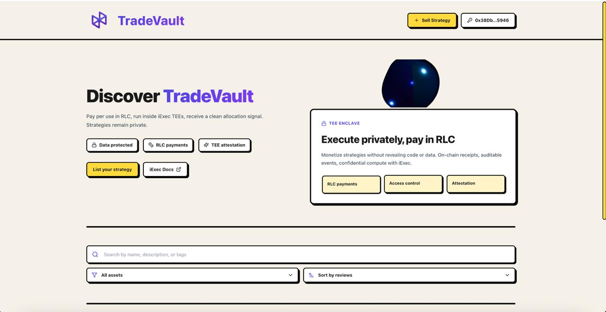
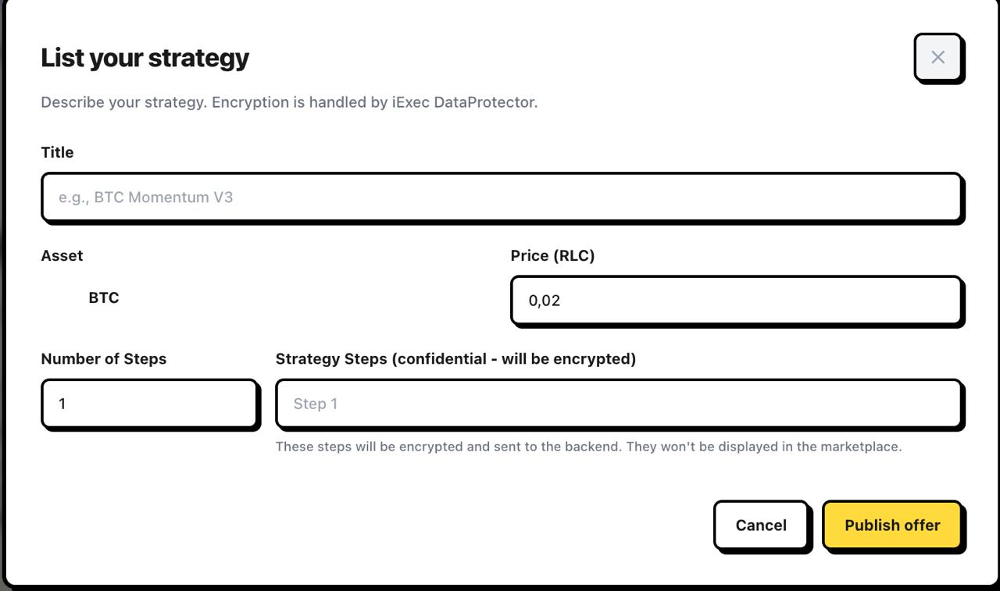
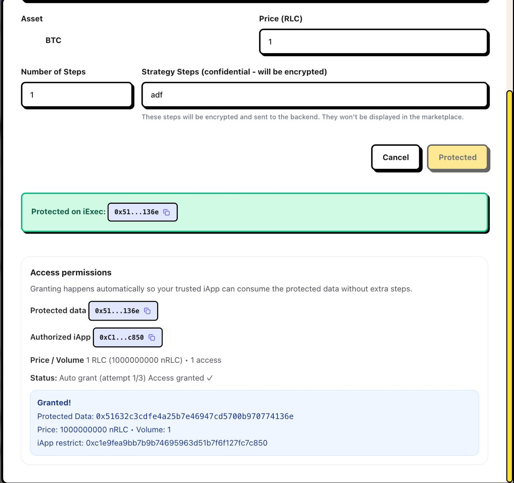
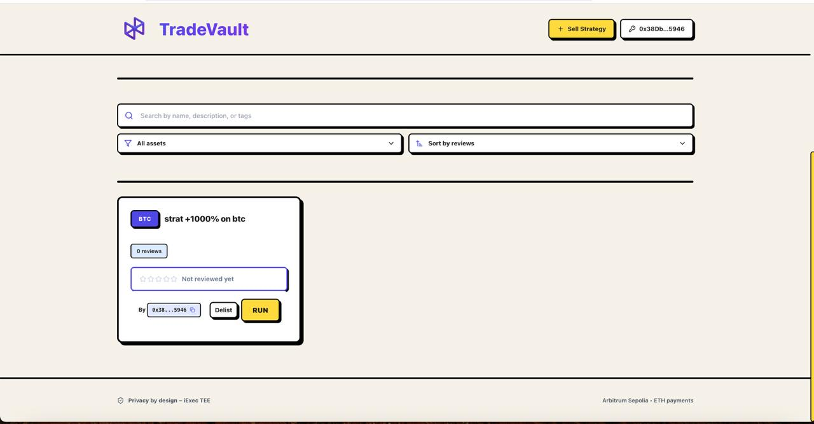

TradeVault: One‑Time Execution Marketplace for Trading Strategies
===============================================================

Overview
--------
TradeVault is a privacy‑preserving marketplace where strategy authors can sell their trading strategies for one‑time execution. Buyers purchase a single run, execute the strategy inside a secure iExec environment, and receive the results without ever seeing the seller’s private logic or data.

The project uses iExec’s DataProtector to tokenize and manage access to protected strategy data on chain, and an iExec iApp to execute strategies off‑chain in a trusted environment. Authentication is handled with Privy, and the frontend is built with React, Vite, and Tailwind CSS.

This project was built using iExec during the ETHRome hackathon by: Youssef Jeddi, Hassen Ezzeddin, Youssef Chelaifa, and Amir Ammmar.

Key features
------------
- Strategy marketplace UI with search, sort, and tags
- Sell a strategy as protected data and optionally pre‑grant an authorized iApp
- One‑time execution per purchase (single‑use access volume)
- Buyer flow to execute an iApp against the seller’s protected strategy
- End‑to‑end privacy: seller code/data never leaves the TEE; buyer only receives the result
- Walletless onboarding with Privy, Tailwind UI components, and Framer Motion animations

How it works (high level)
-------------------------
1. Sellers list strategies by creating Protected Data on chain with iExec DataProtector and setting a grant volume of 1 (single use).
2. Buyers browse strategies, purchase access, and provide an iApp address to execute the run.
3. iExec executes the iApp inside a trusted environment against the Protected Data.
4. The buyer receives the encrypted result; sensitive logic/data remains private.

Architecture
------------
- Frontend: React 18 + Vite + Tailwind CSS (see `src/App.jsx` for the main UI)
- Auth: Privy (`@privy-io/react-auth`)
- iExec: `@iexec/dataprotector` for protected data discovery, access grants, and processing
- iApp (reference): Python iApp in `IApp/` that reads protected inputs and emits machine‑readable results

Screenshots
-----------
Below are sample screens from the marketplace UI.






Getting started
---------------

Prerequisites
- Node.js 18+ and npm

Install and run (development)
1. Clone the repository and open it in your editor.
2. Create an environment file from the example and set your variables.

```
cp .env.example .env
```

3. Install dependencies and start the dev server.

```
npm install
npm run dev
```

The app runs with Vite. By default it will be available on http://localhost:5173/ (or the port Vite chooses).

Environment variables
---------------------
Client‑side env variables (Vite) should be defined in your `.env` file:

- `VITE_PRIVY_APP_ID` (required): Your Privy App ID for authentication.
- `VITE_AUTO_LOAD_PD` (optional, default: `false`): If `true`, the app auto‑loads on‑chain Protected Data listings on startup.
- `VITE_IEXEC_EXPLORER_SLUG` (optional, default: `bellecour`): iExec Explorer network slug.

You can find where these are used in `src/App.jsx`.

Core flows
----------

Seller: list a strategy
- Connect with Privy and create Protected Data via the DataProtector flow.
- Set the authorized iApp (optional) and grant a volume of 1 for one‑time execution pricing.
- Add metadata such as title, description, and tags.

Buyer: purchase and execute
- Browse the marketplace and pick a strategy.
- Provide the iApp address (or use the seller’s suggested authorized app) and confirm the run.
- Wait for the iExec execution to complete and download the encrypted result.

iExec integration
-----------------
- On‑chain protected data discovery and access management via `@iexec/dataprotector`.
- Off‑chain execution inside iExec’s trusted infrastructure (TEE).
- Reference iApp in `IApp/src/app.py`, which:
	- Reads seller‑provided protected inputs (e.g., rules/steps)
	- Fetches market data (example: BTC hourly prices)
	- Evaluates the strategy and writes `result.json` under `IEXEC_OUT` with a compliant `computed.json` manifest

Repository structure (excerpt)
-----------------------------
- `src/` — React app (components, pages, assets)
- `IApp/` — Python iApp reference implementation
- `eslint.config.js`, `tailwind.config.js`, `vite.config.js` — tooling configuration

Notes for development
---------------------
- Styling: Tailwind CSS 3.x with utility‑first components.
- Animations: Framer Motion.
- Web3/iExec: `@iexec/dataprotector`, `ethers`, and viem where needed.
- Auth: Privy React SDK.

Credits
-------
Built using iExec during ETHRome hackathon by:
- Youssef Jeddi
- Hassen Ezzeddin
- Youssef Chelaifa
- Amir Ammar

